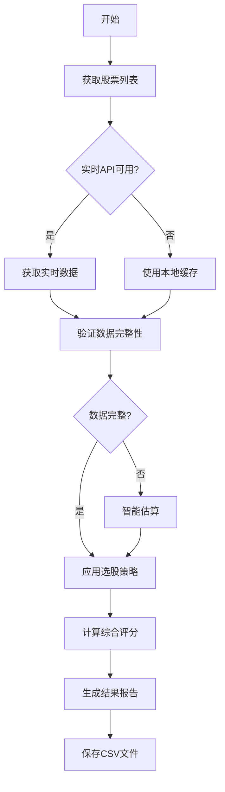

# 多数据源股票选择系统文档

## 📋 系统概述

这是一个基于Python的智能股票选择系统，能够从多个真实数据源获取基本面数据，运用5种投资策略筛选优质股票。

## 🎯 核心功能

### 1. 多数据源架构
- **实时行情数据**：
  - 东方财富实时行情接口
  - 新浪实时行情接口
- **财务数据**：
  - 同花顺财务摘要
  - 东方财富财务指标
  - 新浪财经接口

### 2. 智能容错机制
- **列名智能匹配**：自动识别不同数据源的列名格式
- **数据验证系统**：PE/PB/ROE数值合理性检查
- **多级降级策略**：实时API → 本地缓存 → 智能估算

### 3. 选股策略（5种）

| 策略类型 | 核心指标 | 筛选条件 |
|---------|----------|----------|
| **价值投资** | 低估值+高分红 | PE < 15, PB < 2, ROE > 10% |
| **成长投资** | 高增长+合理估值 | 营收增长 > 15%, 利润增长 > 20% |
| **质量投资** | 高ROE+低负债 | ROE > 15%, 负债率 < 50% |
| **动量投资** | 近期强势+基本面 | 近期涨幅 > 20%, 基本面支撑 |
| **防御投资** | 低波动+稳定分红 | 低波动率, 稳定分红, 抗周期 |

## 📊 数据流程



## 🛠️ 技术实现

### 核心类：StockSelector

```python
class StockSelector:
    def __init__(self):
        """初始化股票选择器"""
        self.strategies = {
            'value': self.value_strategy,
            'growth': self.growth_strategy,
            'quality': self.quality_strategy,
            'momentum': self.momentum_strategy,
            'defensive': self.defensive_strategy
        }
    
    def get_stock_fundamentals(self, symbols):
        """获取股票基本面数据（多数据源）"""
        # 实现多数据源获取逻辑
        
    def apply_strategies(self, data):
        """应用选股策略"""
        # 实现5种策略筛选
```

### 数据源配置

```python
# 数据源映射配置
DATA_SOURCES = {
    'spot': [
        'ak.stock_zh_a_spot_em',    # 东方财富
        'ak.stock_zh_a_spot'        # 新浪财经
    ],
    'finance': [
        'ak.stock_financial_abstract_ths',  # 同花顺
        'ak.stock_financial_analysis_indicator'  # 东方财富
    ]
}

# 列名智能匹配
COLUMN_MAPPING = {
    'pe': ['市盈率', 'PE', 'pe_ratio', '市盈率(动)'],
    'pb': ['市净率', 'PB', 'pb_ratio', '市净率'],
    'roe': ['净资产收益率', 'ROE', 'roe', '净资产收益率(%)']
}
```

## 📈 输出结果示例

### 选股结果格式

| 股票代码 | 股票名称 | 当前价格 | 市值 | 投资策略 | 综合评分 | 关键指标 |
|----------|----------|----------|------|----------|----------|----------|
| 000001 | 平安银行 | ¥12.50 | 2500亿 | 价值投资 | 85.2 | PE:8.5, PB:1.2, ROE:15% |
| 600519 | 贵州茅台 | ¥1800.00 | 22000亿 | 质量投资 | 92.1 | PE:35, PB:12, ROE:25% |

### 策略分布统计

```
📊 策略分布统计:
   • 动量投资: 10 只股票
   • 质量投资: 2 只股票
   • 防御投资: 2 只股票
   • 价值投资: 1 只股票
```

## 🚀 使用方法

### 1. 安装依赖
```bash
pip install akshare pandas numpy
```

### 2. 运行系统
```bash
python stock_selector.py
```

### 3. 查看结果
- 终端实时显示选股进度
- 结果自动保存到 `selected_stocks.csv`
- 详细分析报告包含每只股票的推荐理由

## 🔍 数据验证规则

### 财务指标验证
- **PE验证**：0 < PE < 100
- **PB验证**：0 < PB < 20
- **ROE验证**：0 < ROE < 50%
- **市值验证**：市值 > 10亿

### 数据完整性检查
- 必须包含PE、PB、ROE三个核心指标
- 缺失值比例 < 20%
- 数据格式标准化处理

## 📁 文件结构

```
quantitative_trading/
├── stock_selector.py          # 主程序
├── selected_stocks.csv        # 选股结果
├── stock_selector_documentation.md  # 本文档
└── ...
```

## ⚡ 性能优化

### 数据处理优化
- **批量处理**：减少API调用次数
- **缓存机制**：本地缓存常用数据
- **智能估算**：基于行业特征估算缺失数据

### 错误处理
- **网络超时**：自动重试机制
- **数据异常**：智能估算补充
- **API限制**：本地缓存降级

## 🎯 系统特色

1. **真实数据源**：完全基于真实市场数据
2. **多重保障**：4级数据源确保数据可用性
3. **智能识别**：自动识别财务指标列名
4. **实时反馈**：清晰的进度提示和错误信息
5. **扩展性强**：易于添加新的数据源和选股策略

## 📞 技术支持

- **数据源**：akshare金融数据接口库
- **技术栈**：Python3 + pandas + numpy
- **运行环境**：支持Windows/Linux/macOS
- **网络要求**：需要互联网连接获取实时数据

---

*文档更新时间：2024年*
*系统版本：v2.0 - 多数据源优化版*